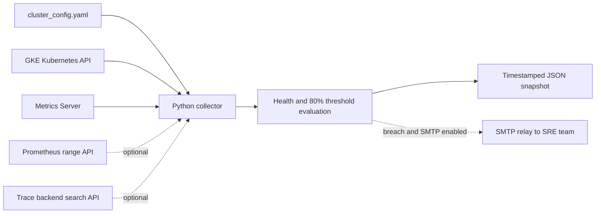

# GKE Kubernetes Observability Automation

Read-only Python collector for Google Kubernetes Engine (GKE) and compatible Kubernetes clusters. One run collects cluster inventory, events, bounded recent container logs, current CPU and memory utilization, optional Prometheus history, optional trace search results, and a health summary. It writes a timestamped JSON snapshot in `output/`.

## What it collects

| Signal | Source | What the snapshot contains |
|---|---|---|
| Cluster state | Kubernetes API | Version, nodes, namespaces, pods, deployments, services, events |
| Container logs | Kubernetes `pods/log` API | Recent lines bounded by time, line count, pod count, optional namespaces and label selector |
| Current resource usage | `metrics.k8s.io` Metrics Server API | Node and pod samples; CPU and memory percent against each node's allocatable capacity |
| Historical metrics | Prometheus-compatible HTTP API (optional) | Configured PromQL range query responses |
| Traces | Configured tracing backend search API (optional) | Backend response from a configured search URL and query parameters |
| Health | Collector checks | API reachability, nodes not Ready, pods outside Running/Succeeded, and resource threshold breaches |

**Threshold behavior:** the default is 80%, inclusive. If a node's CPU **or** memory reaches the configured threshold, it appears in `resource_metrics.threshold_breaches`, the overall health becomes `degraded`, and an email is sent if SMTP alerts are enabled. The percentage is usage divided by node allocatable capacity. Metrics Server readings are point-in-time samples, not historical or per-container limit utilization.

## Architecture and flow



1. Load cluster context and collection bounds from YAML; credentials stay outside the YAML.
2. Authenticate using the configured kubeconfig and read cluster objects and recent pod logs.
3. Read current CPU/memory metrics from Metrics Server and calculate node utilization against allocatable resources.
4. Query Prometheus and the trace backend when enabled. Trace search is backend-specific; OTLP is an ingest protocol and does not retrieve stored spans.
5. Build health status, record threshold breaches, optionally send SMTP alert, then persist a JSON snapshot and any collection errors.

## GKE prerequisites

- Python 3.10 or later and network access to the GKE control plane and enabled telemetry endpoints.
- `gcloud` configured for the intended project and cluster, plus `gke-gcloud-auth-plugin` available on `PATH` when the kubeconfig uses the GKE exec plugin.
- A kubeconfig context with the required Google Cloud IAM access and Kubernetes RBAC. `rbac-readonly.yaml` is an example ClusterRole and binding; adjust its namespace, subject, and identity to match your deployment. Avoid cluster-admin credentials.
- Metrics Server/`metrics.k8s.io` available for resource samples. Prometheus and trace backend endpoints are optional.

For example, configure a context with `gcloud container clusters get-credentials CLUSTER --region REGION --project PROJECT`, then set `cluster.context` in `cluster_config.yaml` to the resulting kubeconfig context. Use the correct location flag for a zonal cluster.

## Install and run

```powershell
python -m venv .venv
.\.venv\Scripts\Activate.ps1
python -m pip install -r requirements.txt
python .\k8s_observability.py --config .\cluster_config.yaml
```

Override the output path and enable diagnostic logs:

```powershell
python .\k8s_observability.py --config .\cluster_config.yaml --output .\output\prod --verbose
```

The process returns `0` when a snapshot is written and `1` on fatal configuration, kubeconfig initialization, or uncaught collection errors. API sections that fail independently are recorded in the snapshot; inspect its top-level `errors` array and section-level `collection_error` fields. The health summary reports `degraded` when API reachability fails, node/pod health is bad, a threshold is breached, or core node/pod/resource data could not be collected.

## Configure

Edit `cluster_config.yaml` for cluster name/context, namespace and pod-log scope, event/log bounds, and threshold. Prometheus and trace queries are off by default. For authenticated endpoints set the configured token environment variables (`PROMETHEUS_TOKEN`, `TRACE_BACKEND_TOKEN`) in the process environment. Credentials should not be committed in YAML.

To enable team email alerts, set `backends.email_alerts.enabled: true`, the approved relay host, sender, and `to` list. SMTP credentials are read from the environment variables named by `username_env` and `password_env` (defaults `SMTP_USERNAME` and `SMTP_PASSWORD`). TLS is enabled by default. An alert is sent on every collection run that still sees a breach; use an alert manager for deduplication, sustained-window evaluation, and recovery notifications.

## Output and operational notes

- Files are named `<cluster>-snapshot-<UTC timestamp>.json` under the selected output directory.
- Pod logs can contain customer data, identifiers, or accidentally printed secrets. Restrict access to snapshots, keep log windows short, use namespace/label filters, apply retention, and redact before sharing.
- The collector is read-only: it does not install agents, change workloads, or create Kubernetes resources.
- Trace retrieval requires an endpoint that supports the configured backend's search API. Confirm URL, parameters, authentication, and response-size limits against that backend.
- The example collector is intended for controlled/on-demand runs. Frequent use on large clusters may require pagination, parallel workers, output retention, API rate limits, and backend-specific filters.

## Project webpage

Serve this folder so the Scope section can fetch and display the current Python source:

```powershell
python -m http.server 8000 --bind 127.0.0.1
```

Open `http://127.0.0.1:8000/`. The five section cards switch between the overview, problem statement, architecture, automation flow, and scope/raw-code panel.

## Files

- `index.html` — interactive project overview, architecture, flow, scope, and raw Python source.
- `google-logo.png` — Google wordmark shown in the page header.
- `k8s_observability.py` — collection, threshold/health evaluation, alerts, and output orchestration.
- `cluster_config.yaml` — cluster settings, collection bounds, and optional backend definitions.
- `rbac-readonly.yaml` — example least-privilege permissions.
- `requirements.txt` — Python dependencies.
- `build_deck.ps1` and `build_deck.mjs` — rebuild the five-slide deck from the existing PowerPoint layout.
- `Kubernetes_Observability_Automation_5slides.pptx` — concise technical design, architecture, and operating guidance.
